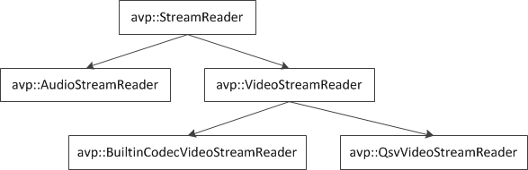
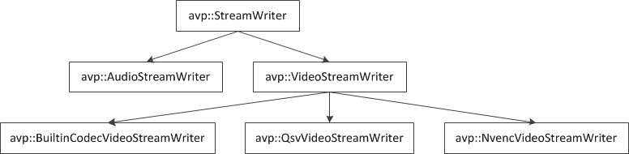

# EasyFFmpeg 一个简单的音视频读写库

## 动机
熟悉图像处理和计算机视觉的同学们应该都用过 OpenCV，当我们要处理视频读写的时候一般都会采用 OpenCV 自带的 `cv::VideoCapture` 和 `cv::VideoWriter`。这两个类本质上是对音视频编解码库 FFmpeg 的封装，并且屏蔽了编解码操作的细节，使用很简单。例如：
```c++
cv::VideoCapture reader;
reader.open("in.mp4");
CV_Assert(reader.isOpened());
cv::Mat frame;
reader.read(frame);

cv::VideoWriter writer;
writer.open("out.avi", CV_FOURCC('M', 'J', 'P', 'G'), 25, frame.size(), frame.type() == CV_8UC3);
CV_Assert(writer.isOpened());
writer.write(frame);

while (reader.read(frame))
{
    cv::imshow("frame", frame);
    writer.write(frame);
    int key = cv::waitKey(20);
    if (key == 'q')
        break;
}
```
对于一般的视频处理而言，`cv::VideoCapture` 和 `cv::VideoWriter` 已经够用了。但是，如果我们要对视频文件做更精细或者深入的处理，这两个类就无法满足需求了。比如：
 1. `cv::VideoCapture::read` 函数返回的帧指向的是一块内部内存，如果需要一块深拷贝的帧，需要调用 `cv::Mat::clone()` 或者 `cv::Mat::copyTo()` 函数进行操作。
 2. `cv::VideoCapture` 读出的帧只能是 BGR 格式，我们无法获得内部 FFmpeg AVCodecContext 解码后直接得到的 YUV420P 格式的帧。
 3. `cv::VideoWriter` 写的视频无法指定编码器的详细参数，无法指定码率。
 4. `cv::VideoWriter` 只能写入灰度帧或者 BGR 格式的帧，无法写入 YUV420P 格式的帧。
 5. `cv::VideoWriter` 在 Windows 操作系统下要输出 H.264 格式编码的视频，需要重编译 opencv_ffmpeg.dll。
 6. `cv::VideoCapture` 和 `cv::VideoWriter` 这两个类都无法处理音频。
 7. `cv::VideoCapture` 和 `cv::VideoWriter` 这两个类都无法处理一个文件中存在超过一路视频流和超过一路音频流的情况。

OpenCV 的视频读写不够强大，无法处理音频，所以最终还是得直接调用 FFmpeg 进行更专业的编解码操作。目标就是写两个类 `AudioVideoReader` 和 `AudioVideoWriter` 对 FFmpeg 进行封装，解决上述问题。

## 第一版 
第一个版本的设计解决了上述的第 1, 3 , 5 和 6 这 4 个问题。这也是最早的需求。我学习了 FFmpeg 源码包里面的 samples，大致阅读了 OpenCV  `cv::VideoCapture` 和 `cv::VideoWriter` 里面调用 FFmpeg 的方法，完成了 `avp::AudioVideoReader`，`avp::AudioVideoWriter` 和 `avp::AudioVideoFrame`。这三个类或者接口体的定义放在了 AudioVideoProcessor.h 中。我的设计有这么几点：
 1. 采用了 [pimpl idiom](https://en.wikipedia.org/wiki/Opaque_pointer) 接口与实现相分离的做法，如果把 EasyFFmpeg 中的 AudioVideoProcessor 文件夹中的源码编成库进行发布，客户端程序只需要包含 AudioVideoProcessor.h 即可使用，不需要包含 FFmpeg 的一大堆头文件。
```c++
namespace avp
{
class AudioVideoReader
{
public:
    //...
private:
    struct Impl;
    std::shared_ptr<Impl> ptrImpl;
};

class AudioVideoWriter
{
public:
    //...
private:
    struct Impl;
    std::shared_ptr<Impl> ptrImpl;
};
}
```
 2. 两个接口类的实现类 `avp::AudioVideoReader::Impl`，`avp::AudioVideoWriter::Impl` 内部 FFmpeg 的数据结构是堆积摆放的，没有经过封装。
 3. `avp::AudioVideoFrame` 仅仅是一个内存的 wrapper，我没有实现这个类的拷贝控制成员函数。
 4. 做了类型定义 `typedef std::pair<std::string, std::string> Option`，支持 FFmpeg `AVDictionary` 形式的参数设置。
 
## 第二版
由于需求的进一步增多，我需要让自己的 `AudioVideoReader` 和 `AudioVideoWriter` 解决上述第 2 和第 6 两个问题。`avp::AudioVideoFrame` 的成员是无法表示 YUV420P，NV12 这种格式的帧的，所以我基本照搬了 FFmpeg AVFrame 的重要成员，完成了 `avp::AudioVideoFrame2`，这个类有这么几个特点：
 1. 能够兼容用 FFmpeg AVFrame 表示的常规的音视频帧。
 2. 有构造函数，能按照指定的视频帧格式和音频帧格式构造帧。
 3. 具备内存管理功能，能进行拷贝控制。如果帧的数据内存由当前实例分配，通过引用计数管理内存。如果帧的数据内存是通过外部指针传入，禁用引用计数。
 
当时还有个支持硬件编解码的需求，就是调用 Intel Quick Sync Video 和 NVIDIA NVENC 对 H.264 视频进行编解码。尽管 FFmpeg 支持这两个第三方库，但是兼容性并不理想。记得去年初还在 Intel 的官方论坛上，看到有开发人员问为什么通过 FFmpeg 调用 Intel 的解码器，解出来的视频帧数量不对的问题。结果被 Intel 的支持怼回去说是 FFmpeg 的问题，用我们自家的 sample 解码没问题，╮(╯_╰)╭。所以我干脆就自己封装这两个硬件解码库。新版的音视频读写类是 `avp::AudioVideoReader2`，`avp::AudioVideoWriter2`，这两个类的实现类是 `avp::AudioVideoReader2::Impl`，`avp::AudioVideoWriter2::Impl`。

这一版，除了重新设计了带引用计数和拷贝控制的 `avp::AudioVideoFrame2`，另一点就是如何同时兼容 FFmpeg
自己的编解码功能和需要我自己封装的编解码功能。注意到音视频文件都是按照 stream 组织的，FFmpeg `AVFormatContext` 中也有 `AVStream *` 类型的 `streams` 这个成员。因此我决定这么处理：

`avp::AudioVideoReader2::Impl` 内部采用 `avp::StreamReader` 进行组织：
 * `avp::AudioStreamReader` 继承 `avp::StreamReader` 处理音频流。
 * `avp::VideoStreamReader` 继承 `avp::StreamReader` 处理视频流。 

`avp::AudioVideoReader2::Impl` 中有成员 `std::unique_ptr<avp::AudioStreamReader> audioStream` 和 `std::unqiue_ptr<avp::VideoStreamReader> videoStream` 分别表示音频流和视频流。`avp::AudioStreamReader` 直接调用 FFmpeg 音频解码器进行解码。`avp::VideoStreamReader` 是一个基类，它有两个派生类：
 1. `avp::BuiltinCodecVideoStreamReader` 直接调用 FFmpeg 自带的解码器进行解码的视频流。
 2. `avp::QsvVideoStreamReader` 调用 Intel Quick Sync Video 进行解码的视频流。



音视频编码类也是采用了类似的做法。 `avp::AudioVideoWriter2::Impl` 内部采用 `avp::StreamWriter` 进行组织：
 * `avp::AudioStreamWriter` 继承 `avp::StreamWriter` 处理音频流。
 * `avp::VideoStreamWriter` 继承 `avp::StreamWriter` 处理视频流。 

`avp::AudioVideoWriter2::Impl` 中有成员 `std::unique_ptr<avp::AudioStreamWriter> audioStream` 和 `std::unqiue_ptr<avp::VideoStreamWriter> videoStream` 分别表示音频流和视频流。`avp::AudioStreamWriter` 直接调用 FFmpeg 音频编码器进行编码。`avp::VideoStreamWriter` 是一个基类，它有三个派生类：
 1. `avp::BuiltinCodecVideoStreamWriter` 直接调用 FFmpeg 自带的解码器进行编码的视频流。
 2. `avp::QsvVideoStreamWriter` 调用 Intel Quick Sync Video 进行编码的视频流。
 3. `avp::NVENCVideoStreamWriter` 调用 NVDIA NVENC 进行编码的视频流。


 
调用 Intel 和 NVIDIA 硬件编解码的代码 github 上没给出。

## 第三版
最后又需要解决前面所述第 7 个问题。前面的两个版本都无法处理这个情况。于是我写了 `avp::AudioVideoReader3`，它的实现类 `avp::AudioVideoReader3::Impl` 中有一个成员 `std::vector<std::unique_ptr<avp::StreamReader> >` 保存所有音视频流解码类的基类指针。相应的，对于写音视频，我写了 `avp::AudioVideoWriter3`，它的实现类 `avp::AudioVideoWriter3::Impl` 中有一个成员 `std::vector<std::unique_ptr<avp::StreamWriter> >` 保存所有音视频流编码类的基类指针。

## 限制
本代码开发基本上是基于 FFmpeg 2.8.6，进入 3.0.0 系列后结构发生了很大变化 `AVStream` 中不再有 `AVCodecContext *` 成员，libavcodec 修改了编解码 API。

本代码仅在 Windows 平台上测试过。现在 FFmpeg 官网上提供的 Windows 下预编译好的二进制文件已经找不到 2.8.6 版本的了，不过我的 github 上还是给出了这个版本的头文件和 64 位的库文件。
